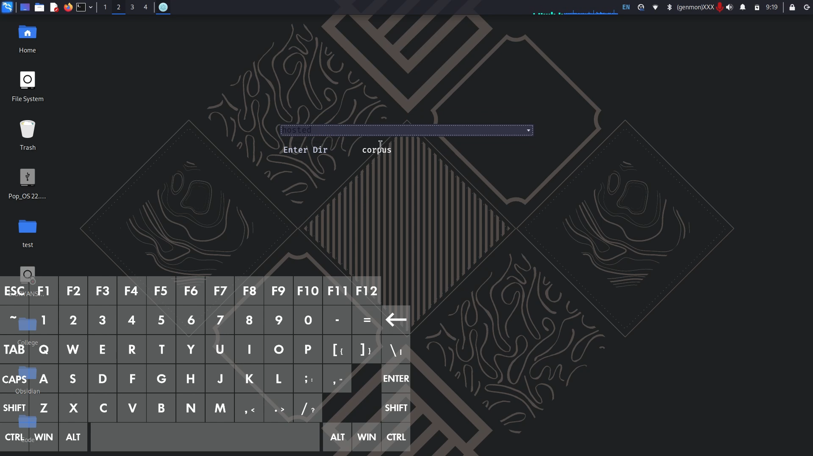
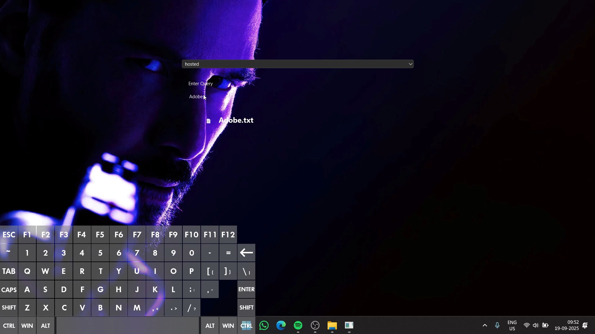

# <div align="center">Vector Space Model for Information Retrieval</div>
<div align="center">
  <em>Assignment 1 for CSD358 Information Retrieval</em>
</div>

## Provided Features
- Ranked retrieval utilising vector space indexing, and cosine similarity based search.
- Follows lnt.ltc ranking schemes.
- Supports `n-gram` searches.
- Supports fallback searches via `fuzzy` searches measuring `Jaro-Winkler similarity`, and `Soundex` algorithm.
- Utilises `K-means clustering` via tf-idf weights based cluster generation.
- Supports information retrieval from documents such as PDFs, TXTs, DOCX and OCR.
- 
---
## Installation
```
git clone https://github.com/Eros483/Information_Retrieval_VSM.git
cd Information_Retrieval_VSM
pip install -e .
uvicorn api.app:app --reload
```
---

## Usage
Navigate to `http://localhost:8000/docs` for instructions on how to use the API.

---
## Demo

### Linux
[](https://www.youtube.com/watch?v=x-KFU4setRM)


### Windows
[](https://www.youtube.com/watch?v=FRl_FN2sPvc)


